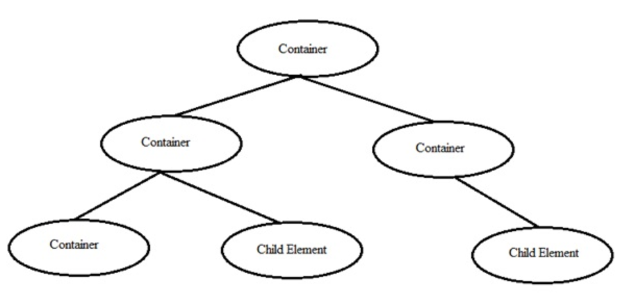
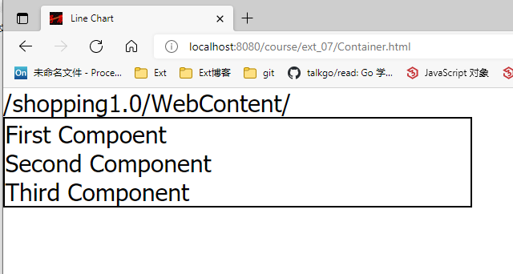
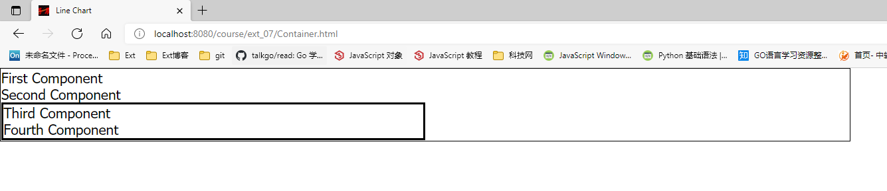
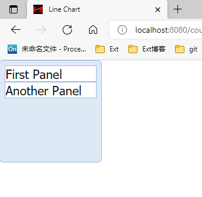
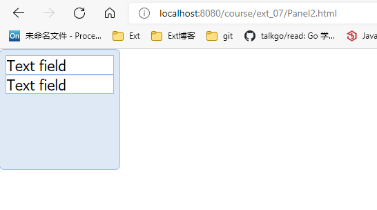
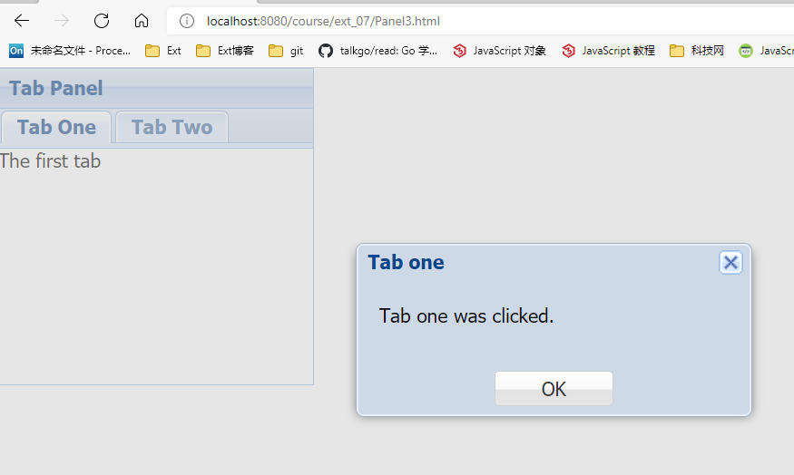
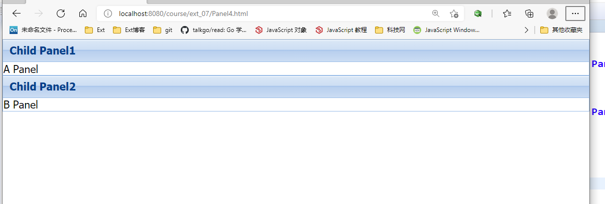

# 1. Ext.js 概述

# 2. Ext.js 环境设置

# 3. Ext.js 命名约定

# 4. Ext.js 架构

# 5. Ext.js 第一个程序

```jsp
<%
String path = request.getContextPath();
String basePath = request.getScheme() + "://" + request.getServerName() + ":" + request.getServerPort() + path;
%>
<%@ page language="java" contentType="text/html; charset=ISO-8859-1" pageEncoding="ISO-8859-1"%>
<!DOCTYPE html PUBLIC "-//W3C//DTD HTML 4.01 Transitional//EN" "http://www.w3.org/TR/html4/loose.dtd">
<html>
<head>
	<base href="<%=basePath%>">
	<meta http-equiv="Content-Type" content="text/html; charset=utf8">
	<title>Insert title here</title>

	<link rel="stylesheet" type="text/css" href="<%=request.getContextPath()%>/ext-4.2.1.883/resources/css/ext-all.css">
	<link rel="stylesheet" type="text/css" href="<%=request.getContextPath()%>/ext-4.2.1.883/resources/ext-theme-classic/ext-theme-classic-all.css">
	<script type="text/javascript" src="<%=request.getContextPath()%>/ext-4.2.1.883/ext-all-dev.js"></script>
	
	<script type="text/javascript">
		Ext.onReady(function() {
			Ext.create('Ext.panel.Panel', {
				renderTo: 'helloWorldPanel',
				height: 200,
				width: 600,
				title: 'Hello World',
				html: 'First Ext JS Hello World Program'
			})
		})
	</script>
</head>
<body>
	<div id="helloWorldPanel"></div>
</body>
</html>
```

- Explanation
  - Ext.onReady() 方法将在 ExtJS 准备好渲染 ExtJS 元素时调用
  - Ext.create() 方法用于在 ExtJS 中创建对象，这里我们创建一个简单的面板类 Ext.panel.Panel 的对象
  - Ext.panel.Panel 是 ExtJS 中用于创建面板的预定义类
  - 每个 ExtJS 类都有不同的属性来执行一些基本的功能
- Ext.panel.Panel 类有以下各种属性
  - renderTo: 'helloWorldPanel' 是此面板必须呈现的元素。helloWorldPanel 是jsp中的div id
  - height/width 用于提供面板的自定义尺寸
  - title 为面板提供标题
  - html 在面板中显示的HTML内容


# 6. Ext.js Class系统

- Ext JS 是一个 JavaScript 框架，它具有面向对象编程的功能。
- Ext 是封装 Ext JS 中所有类的命名空间

##  1. 在Ext JS 中定义类

- Ext 提供了300多个类，我们可以使用各种功能
- Ext.define() 用于在 Ext JS 中定义类

## 2. 语法

>Ext.define(class name, class members/properties, callback function);

类名称是根据应用程序结构的类名称。appName.folderName.ClassName

studentApp.view.StudentView。

类属性/成员 - 定义类的行为。

回调函数是可选的。当类正确加载时，会调用它。

## 3. Ext JS 类定义示例

```javascript
Ext.define(studentApp.view.StudentDetailsGrid, {
    extend: 'Ext.grid.GridPanel',
    id: 'studentsDetailsGridPanel',
    store: 'StudentsDetailsGridStore',
    renderTo: 'studentsDetailsRenderDiv',
    layout: 'fit',
    columns: [{
        text: 'Student Name',
        dataIndex: 'studentName'
    }, {
        text: 'ID',
        dataIndex: 'studentId'
    }, {
        text: 'Department',
        dataIndex: 'department'
    }]
});
```


## 4. 创建对象

- 像其他语言一样，我们也可以在 Ext JS 中创建对象。

- 不同的方式创建对象在 Ext JS

- 使用 new 关键字：

  > ```javascript
  > var studentObject = new student();
  > studentObject.getStudentName();
  > ```

- 使用 Ext.create();

  > ```javascript
  > Ext.create('Ext.Panel', {
  >     renderTo: 'helloWorldPanel',
  >     height: 100,
  >     width: 100,
  >     title: 'Hello World',
  >     html: 'First Ext JS Hello Program'
  > });
  > ```


## 5. Ext JS中的继承

- 继承是将类A中定义的功能用于类B的原理。

- 在 Ext JS 继承可以使用两种方法：

- Ext.extend:

  > ```javascript
  > Ext.define(studentApp.view.StudentDetailsGrid, {
  >     extend: 'Ext.grid.GridPanel',
  >     ...
  > });
  > ```

- 这里我们自定义类StudentDetailsGrid使用 Ext JS 类 GridPanel 的基本功能。

- Mixins:

  > ```JAVASCRIPT
  > mixins: {
  >     commons: 'DepartmentApp.utils.DepartmentUtils'
  > }
  > ```

- Mixins 是在没有扩展的情况下，在类B中使用类A的不同方式。（也可以在类B中使用更多的类的功能）


# 7. Ext.js 集装箱

## 1. 容器

- Ext JS 中的容器使我们可以添加其他容器或子组件的组件。
- 这些容器可以具有多个布局，已将不见不止在容器中。
- 我们可以从容器和其子元素添加或删除组件。
- Ext.container.Container 是 Ext JS 中所有容器的基类。



## 2. Ext JS 容器内的组件

###  1. 描述

- 容器中的组件： 我们可以在容器内部有多个组件

### 2. 语法

> ```javascript
> var component1 = Ext.create('Ext.Component', {
>     html: 'First Component'
> });
> Ext.create('Ext.container.Container', {
>     renderTo: Ext.getBody(),
>     items: [component1]
> });
> ```

- 我们可以将组件作为容器中的项目

### 3. 例

- 以下是显示容器内部组件的简单实例

> ```html
> <!DOCTYPE html>
> <html>
>     <head>
>     	<meta http-equiv="Content-Type" content="text/html; charset=iso-8859-1">
>     	<title>Line Chart</title>
>     	<link rel="stylesheet" type="text/css" href="../../../ext-4.2.1.883/resources/ext-theme-classic/ext-theme-classic-all.css" />
>     	<!-- GC -->
>     	<script type="text/javascript" src="../../../ext-4.2.1.883/ext-all.js"></script>
> 
>     <script type="text/javascript" src="Container.js"></script>
>     </head>
>     <body>
>         <script type="text/javascript">
>         	Ext.onReady(function() {
>                 var component1 = Ext.create('Ext.Component', {
>                     html: 'First Compoent'
>                 });
>                 var component2 = Ext.create('Ext.Component', {
>                     html: 'Second Component'
>                 });
>                 var component3 = Ext.create('Ext.Component', {
>                     html: 'Third Component'
>                 });
>                 Ext.create('Ext.container.Container', {
>                     renderTo: Ext.getBody(),
>                     title: 'Container',
>                     border: 1,
>                     width: '50%',
>                     style: {
>                         borderStyle: 'solid', 
>                         borderWidth: '2px'
>                     },
>                     items: [component1, component2, component3]
>                 });
>             });
>         </script>
>     </body>
> </html>
> ```



## 3. Ext JS 容器内的容器

### 1. 描述

- 容器内的容器：我们可以再其他容器内部的容器作为父容器的组件以及其他组件。

### 2. 语法

> ```javascript
> var container = Ext.create('Ext.container.Container', {
>     items: [component3, component4]
> });
> Ext.create('Ext.container.Container', {
>     renderTo: Ext.getBody(),
>     items: [container]
> });
> ```
>
> 

### 3. 例

```javascript
<!DOCTYPE html>
<html>
    <head>
    	<meta http-equiv="Content-Type" content="text/html; charset=iso-8859-1">
    	<title>Line Chart</title>
    	<link rel="stylesheet" type="text/css" href="../../../ext-4.2.1.883/resources/ext-theme-classic/ext-theme-classic-all.css" />
    	<!-- GC -->
    	<script type="text/javascript" src="../../../ext-4.2.1.883/ext-all.js"></script>

    <script type="text/javascript" src="Container.js"></script>
    </head>
    <body>
        <script type="text/javascript">
        	Ext.onReady(function () {
         		var component1 = Ext.create('Ext.Component', {
            		html:'First Component'
         		});

        		 var component2 = Ext.create('Ext.Component', {
            		html: 'Second Component'
         		});

         		var component3 = Ext.create('Ext.Component', {
           	 		html: 'Third Component'
         		});

         		var component4 = Ext.create('Ext.Component', {
            		html: 'Fourth Component'
         		});

         		var container = Ext.create('Ext.container.Container', {
            		style: {borderStyle: 'solid', borderWidth: '2px' },
            		width: '50%',
            		items: [component3, component4]
         		});

                 Ext.create('Ext.container.Container', {
                    renderTo: Ext.getBody(),
                    title: 'Container',
                    border: 1,
                    width: '50%',
                    style: {borderStyle: 'solid', borderWidth: '2px' },
                    items: [component1, component2,  container]
                 });
              });
        </script>
    </body>
</html>
```




## 4. 其他容器

### 1. Ext.panel.Panel

### 1. 描述

Ext.panel.Panel：允许在正常面板中添加项目的基本容器

### 2. 语法

> ```javascript
> Ext.create('Ext.panel.Panel', {
>     //this way we can add differnt child elements to the container as container items.
>     items: [child1, child2]
> });
> ```

### 3. 例

```javascript
<!DOCTYPE html>
<html>
    <head>
    	<meta http-equiv="Content-Type" content="text/html; charset=iso-8859-1">
    	<title>Line Chart</title>
    	<link rel="stylesheet" type="text/css" href="../../../ext-4.2.1.883/resources/ext-theme-classic/ext-theme-classic-all.css" />
    	<!-- GC -->
    	<script type="text/javascript" src="../../../ext-4.2.1.883/ext-all.js"></script>

    <script type="text/javascript" src="Container.js"></script>
    </head>
    <body>
        <script type="text/javascript">
        	Ext.onReady(function () {
         		var childPanel1 = Ext.create('Ext.panel.Panel', {
                    html: 'First Panel'
                });
            	var childPanel2 = Ext.create('Ext.panel.Panel', {
                    html: 'Another Panel'
                });
            	Ext.create('Ext.panel.Panel', {
                    renderTo: Ext.getBody(),
                    width: 100,
                    height: 100,
                    border: true,
                    frame: true,
                    items: [childPanel1, childPanel2]
                });
            });
        </script>
    </body>
</html>
```




### 2. Ext.form.Panel

### 1. 描述

- Ext.form.Panel：Form面板为表单提供了一个标准容器，它本质上是一个标准的Ext.panel.Panel，它自动创建一个用于管理任何Ext.form.field.Field对象的BasicForm。

### 2. 语法

> ```javascript
> Ext.create('Ext.form.Panel', {
>     //我们可以将不同的子元素添加到容器中
>     items: [child1, child2]
> });
> ```

### 3. 例

<!DOCTYPE html>
<html>
    <head>
    	<meta http-equiv="Content-Type" content="text/html; charset=iso-8859-1">
    	<title>Line Chart</title>
    	<link rel="stylesheet" type="text/css" href="../../../ext-4.2.1.883/resources/ext-theme-classic/ext-theme-classic-all.css" />
    	<!-- GC -->
    	<script type="text/javascript" src="../../../ext-4.2.1.883/ext-all.js"></script>

```html
<!DOCTYPE html>
<html>
    <head>
    	<meta http-equiv="Content-Type" content="text/html; charset=iso-8859-1">
    	<title>Line Chart</title>
    	<link rel="stylesheet" type="text/css" href="../../../ext-4.2.1.883/resources/ext-theme-classic/ext-theme-classic-all.css" />
    	<!-- GC -->
    	<script type="text/javascript" src="../../../ext-4.2.1.883/ext-all.js"></script>

    <script type="text/javascript" src="Container.js"></script>
    </head>
    <body>
        <script type="text/javascript">
        	Ext.onReady(function () {
         		var child1 = Ext.create('Ext.Panel', {
                    html: 'Text field'
                });
                var child2 = Ext.create('Ext.Panel', {
                    html: 'Text field'
                });
                Ext.create('Ext.form.Panel', {
                    renderTo: Ext.getBody(),
                    width: 100,
                    height: 100,
                    border: true,
                    frame: true,
                    layout: 'auto',//auto is one of the layout type
                    items: [child1, child2]
                });
            });
        </script>
    </body>
</html>
```


### 3. Ext.tab.Panel

### 1. 描述

- Ext.tab.Panel：标签面板，就像一个普通的面板，但支持卡标签面板布局。

### 2. 语法

> ```javascript
> Ext.create('Ext.tab.Panel', {
>     //将不同的子容器作为容器项，添加到容器中。
>     items: [child1, child2]
> });
> ```
>
> 

### 3. 例

```html
<!DOCTYPE html>
<html>
    <head>
    	<meta http-equiv="Content-Type" content="text/html; charset=iso-8859-1">
    	<title>Line Chart</title>
    	<link rel="stylesheet" type="text/css" href="../../../ext-4.2.1.883/resources/ext-theme-classic/ext-theme-classic-all.css" />
    	<!-- GC -->
    	<script type="text/javascript" src="../../../ext-4.2.1.883/ext-all.js"></script>

    <script type="text/javascript" src="Container.js"></script>
    </head>
    <body>
        <script type="text/javascript">
        	Ext.onReady(function () {
         		Ext.create('Ext.tab.Panel', {
                    renderTo: Ext.getBody(),
                    width: 100,
                    height: 200,
                    items: [{
                        xtype: 'panel',
                        title: 'Tab One',
                        html: 'The first tab',
                        listeners: {
                            render: function() {
                                Ext.MessageBox.alert('Tab one'， 'Tab one was clicked.');
                            }
                        }
                    }, {
                        xtype: 'panel',
                        title: 'Tan Two',
                        html: 'The second tab',
                        listeners: {
                            render: function() {
                                Ext.MessageBox.alert('Tab two', 'Tab two was clicked.');
                            }
                        }
                    }]
                });
            });
        </script>
    </body>
</html>
```




### 4. Ext.container.ViewPort

### 1. 描述

- Ext.container.Viewport：Viewport是一个容器，他会自动调整大小到整个浏览器窗口大小。然后，我们可以在其中添加其他的 ExtJS UI组件和容器。

### 2. 语法

> ```javascript
> Ext.create('Ext.container.Viewport', {
>     //这样，我们就可以将不同的子元素作为容器项，添加到容器中。
>     items: [child1, child2]
> });
> ```

### 3. 例

```html
<!DOCTYPE html>
<html>
    <head>
    	<meta http-equiv="Content-Type" content="text/html; charset=iso-8859-1">
    	<title>Line Chart</title>
    	<link rel="stylesheet" type="text/css" href="../../../ext-4.2.1.883/resources/ext-theme-classic/ext-theme-classic-all.css" />
    	<!-- GC -->
    	<script type="text/javascript" src="../../../ext-4.2.1.883/ext-all.js"></script>

    <script type="text/javascript" src="Container.js"></script>
    </head>
    <body>
        <script type="text/javascript">
        	Ext.onReady(function () {
         		var childPanel1 = Ext.create('Ext.panel.Panel', {
                    title: 'Child Panel 1',
                    html: 'A Panel'
                });
                var childPanel2 = Ext.create('Ext.panel.Panel', {
                    title: 'Child Panel2',
                    html: 'B Panel'
                });
                Ext.create('Ext.container.Viewport', {
                    renderTo: Ext.getBody(),
                    items: [childPanel1, childPanel2]
                });
            });
        </script>
    </body>
</html>
```




# 8. Ext.js 布局

# 9. Ext.js 组件

# 10. Ext.js 拖放

# 11. Ext.js 主题

# 12. Ext.js 自定义事件和监听器

# 13. Ext.js 数据

- 数据包用于加载和保存应用程序中的所有数据。
- 数据包有许多类，但最重要的类是：
  - 模态（model），也叫模型
  - 商店（store）
  - 代理（proxy）

## 1. 模型

- model 的基类是 Ext.data.Model.It 表示应用程序中的一个实体，它将存储数据绑定到视图。它有后端数据对象到视图 dataIndex 的映射。在store 的帮助下获取数据。

## 2. 创建模型

- 为了创建一个模型，我们需要扩展 Ext.data.Model 类，我们需要定义字段的名称和映射。

> ```javascript
> Ext.create('StudentDataModel', {
>     extend: 'Ext.data.Model',
>     fields: [{
>         name: 'name',
>         mapping: 'name'
>     }, {
>         name: 'age',
>         mapping: 'age'
>     }, {
>         name: 'marks',
>         mapping: 'marks'
>     }]
> });
> ```

- 这里的名称应该与我们在视图中声明的 dataIndex 相同，并且映射应该匹配使用 store 从数据库获取的静态或动态数据。

## 3. 商店

- store 的基类是 Ext.data.Store。它包含本地缓存的数据，该数据将在模型对象的帮助下，在视图上呈现。存储使用代理获取数据，代理具有为服务定义的路径以获取后端数据。

## 4. 静态存储

- 对于静态存储，我们将存储在存储中的所有数据如下：

> ```javascript
> Ext.create('Ext.data.Store', {
>     model: 'StudentDataModel',
>     data: [{
>         name: 'Asha',
>         age: '16',
>         marks: '90'
>     }, {
>         name: 'Vinit',
>         age: '18',
>         marks: '95'
>     }, {
>         name: 'Anand',
>         age: '20',
>         marks: '68'
>     }, {
>         name: 'Niharika',
>         age: '21',
>         marks: '86'
>     }, {
>         name: 'Manali',
>         age: '22'.
>         marks: '57'
>     }]
> });
> ```

## 5. 动态存储

- 可以使用代理获取动态数据。我们可以让代理可以从Ajax、Rest和Json获取数据。

## 6. 代理

- 代理的基类是 Ext.data.proxy.Proxy。代理由模型和商店用于处理模型数据的加载和保存。
- 代理由两种类型：
  - 客户端代理
  - 服务端代理

## 7. 客户端代理

- 客户端代理包括使用HTML5本地存储的内存和本地存储

## 8. 服务器代理

- 服务器代理使用Ajax，Json数据和Rest服务处理来自远程服务器的数据。
- 定义服务器中的代理：

> ```javascript
> Ext.create('Ext.data.Store', {
>     // 使用模型，对字段进行映射
>     model: 'StudentDataModel',
>     proxy: {
>         type: 'rest',
>         actionMethods: {
>             // 使用 GET OR POST Method
>             read: 'POST'
>         },
>         // here we have to include the rest URL path which fetches data from database or Json file path where the data is stored
>         url: 'restUrlPathOrJsonFilePath',
>         reader: {
>             //接收服务器来的数据
>             type: 'json',
>             root: 'data'
>         }
>     }
> });
> ```


# 14. Ext.js 字体

# 15. Ext.js 风格

# 16. Ext.js 图像

# 17. Ext.js 本地化

# 18. Ext.js 可访问性

# 19. Ext.js 调试代码

# 20. Ext.js 方法