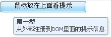
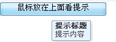

## 1. ExtJS4.2.1

#### 1. 主页面index.jsp

- index.jsp
  - 引入xxx.css/xxx.js/xxx.png
  - 根目录：src="pageContext.request.ContextPath"/xxx/xxx/xxx
  - ExtJS会将内容填充到 <body></body>中

#### 2. 入口 app.js

```js
//代表ExtJS4应用，以下是Ext.app.Application的典型写法
Ext.application(
	name: 'mmm',//命名空间，用于创建类等
    autoCreateViewport: true,//框架自动创建Viewport组件
    models:['CardModel', ...],//引入model模块
    stores: ['CardStore', ...],//引入store模块
    controllers: ['CardCtl', ...],//引入controller模块
    requires: ['Ext.Ajax']//异步加载机制
);
//如果没有下面这句代码，Ext会按照默认的地址：http://www.extjs.com/s.gif去下载这张图片，由于网络不通或者速度较慢等原因，可能导致这张图片加载不成功，造成页面上很多小白条。
Ext.BLANK_IMAGE_URL = '../../../core/extjs/resources/images/default/s.gif';
//初始化后就会激活提示功能
Ext.tip.QuickTipManager.init();
//利用Ext.apply()函数重新设置QuickTips的默认属性
Ext.apply(Ext.tip.QuickTipManager.getQuickTip(), {
    maxWidth: 200,
    minWidth: 100,
    showDelay: 50
})
```

- Ext.tip.QuickTipManager.init();例子

```js
Ext.tip.QuickTipManager.init();
disable()禁止组件,
enable()启用组件,
register()为DOM元素注册提示功能,
unregister()取消提示功能

```

**注册提示**



```js
<script type="text/javascript" defer>
		Ext.onReady(function(){   
    		Ext.QuickTips.init();
    		Ext.QuickTips.register({
    			target : 'lwc',//给哪个DOM元素注册提示信息
    			title : '第一型',
    			text : '从外部注册到DOM里面的提示信息'
    		});
       });  
    </script>
   </head>
   <body>
   		<input type = 'button' id ='lwc' value='鼠标放在上面看提示'/>
   </body>
</html>
```

**标签提示**



```js
<script type="text/javascript" defer>
		Ext.onReady(function(){   
    		Ext.QuickTips.init();
       });  
    </script>
   </head>
   <body>
   		<input type = 'button' id ='lwc' value='鼠标放在上面看提示'
   		ext:qtitle = '提示标题' ext:qtip='提示内容'/>
   </body>
</html>
```

- 默认情况下提示信息0.5秒后显示,显示5秒后消失
- 有时候需要修改默认,最简单的方式是利用Ext.apply()函数重新设置QuickTips的默认属性

#### 3.  controllers

```js
CardCtl.js
//定义一个class
Ext.define('mmm.controller.CardCtl', {
    extend: 'Ext.app.Controller',//集成 Ext.app.Controller
    //添加引用，框架会自动添加get方法，用于取值
    refs: [
    	{
            ref: 'CardGrid', //引用 CardGrid.js（用于返回视图，也就是展示什么给页面）
            selector: 'cardgrid'//别名
        },
        {
            ref: 'ParentContainer', //引用 ParentContainer.js（用于返回视图，也就是展示什么给页面）
            selector: 'parentcontainer'//别名
        },
        {
            ref: 'ParentContainerPanel', //引用 ParentContainerPanel.js（用于返回视图，也就是展示什么给页面）
            selector: 'parentcontainerpanel panel[name=page2Panel]'//别名
        }
    ],
    stores: ['CardStore', ...],
	views: ['CardGrid', ...],
    //初始化函数，用于增加点击事件
    init: function() {
        this.control({
            'cardgrid>toolbar button[action=add]': {
                click: this.addNewCardModel
            },
            'cardgrid>toolbar button[action=del]': {
                click: this.delCardModel
            },
            'cardgrid': {
                cellclick: this.gridOnCellClick
            },
            'parentcontainer button[action=back]': {
                click: this.backToMain
            }
        })
    },
    //addNewCardModel事件
    addNewCardModel: function() {
        var win = Ext.ComponentMgr.get('cardAddWin');
        if (!win) {
            var win = Ext.create('mmm.view.PopWin', {
                id: 'cardAddWin',
                width: 515,
                heitht: 425,
                title: '新增定制打分卡'
            })
        }
        win.add({
            xtype: 'mytabpanel',
            autoEWidth: true,
            autoHeight: true
        })
        win.show();
    },
    //delCardModel事件
    delCardModel: function(com, e, opt) {
        var grid = this.getCardGrid();
        var selArr = grid.getSelectionModel().getSelection();
        if (selArr.length == 0) {
            Ext.MessageBox.alert('操作提示'， '请选择需要删除的记录！');
            return;
        }
        //var record = selArr[0];
        var selId = '';
        var i = 0;
        Ext.each(selArr, function(item) {
            if (i > 0) {
                selId += '|';
            }
            selId += item.get('scrCardId');
            i++;
        })
        var store = grid.getStore();
        var myCbStore = this.getCardShortStoreStore();
        Ext.MessageBox.confirm('提示', '确实要删除所选择的记录吗？', function(btn) {
            if (btn == 'yes') {
                //store.remove(record);
                Ext.getBody().mask('请稍等，正在删除中...', 'x-mask-loading');
                com.setDisabled(true);
                Ext.each(selArr, function(item) {
                    store.remove(item);
                })
                //发送ajax请求给后台
                ERxt.Ajax.request({
                    url: 'xxx/xxx/xxx/xxx?xxx=xxx&xxx=xxx',
                    //请求参数
                    params: {
                        'scrCardId': selId,
                        'xxx': xxx
                    },
                    //响应成功结果
                    success: function(response, opts) {
                        if (eval(response.responseText) == true) {
                            myCbStore.load();
                            Ext.MessageBox.alert('操作提示'， '删除成功！');
                        } else {
                             Ext.MessageBox.alert('操作提示'， '删除失败，请查找原因！');
                        }
                        Ext.getBody().unmask();
                        com.setDisabled(false);
                    },
                    //响应失败结果
                    failture: function(response, opts) {
                        Ext.MessageBox.show('failed');
                        com.setDisabled(false);
                        Ext.getBody().unmask();
                    }
                })
            }
        })
    },
    //gridOnCellClick事件
    gridOnCellClick: function(thisTab, td, cellIndex, record, tr, rowIndex, event, eventObj) {
        if (cellIndex == 6 && event.target.tagName == 'IMG') {
            this.getParentContainer().getLayout().setActiveItem(1);
            this.getParentContainerPanel().removeAll();
            var ht = Ext.getBody().getHeight() * 0.995?(Ext.getBody().getHeight() * 0.995 - 40) : '72%';
            this.getParentContainerPanel().add({html: "<iframe src='app/fdetail/CardDetail.html?id=" + record.raw.scrCardId + "' width='100%' height=" + ht + " frameborder=0 scrolling=auto></iframe>"});
        }
    },
    //backToMain事件
    backToMain: function(){
        this.getParentContainer().getLayout().setActiveItem(0);
    }
});
```


#### 4. stores

```js
CardStore.js
Ext.define('mmm.store.CardStore', {
    extend: 'Ext.app.Store',
    requires: 'mmm.model.CardModel',
    model: 'mmm.model.CardModel',
    autoLoad: false,
    pageSize: 25,
    proxy: {
        type: 'ajax',
        url: 'xxx/xxx/xxx.action',
        model: 'mmm.model.CardModel',
        reader: {
            type: 'json',
            root: 'cardList',
            successProperty: 'success',
            totalProperty: 'totalSize'
        },
        actionMethods: {
            read: 'POST'
        },
        writer: {
            type: 'json'
        },
        extraParams: {
            'scrCardId': '',
            'scrCardFrq': ''
        }
    }
});
```


#### 5. views

```js
CardGrid.js
Ext.define('mmm.view.CardGrid', {
    extend: 'Ext.grid.Panel',
    //title: '指标列表',
    alias: 'widget.cardgrid',
    height: Ext.getBody().getHeight() * 0.995?(Ext.getBody().getHeight() * 0.995 - 125) : '72%',
    viewConfig: {
        loadingText: '查询中...'
    },
    store: 'CardStore',
    sortableColumns: false,
    enableColumnMove: false,
    enableColumnHide: false,
    forceFit: true,
    columns: [
        {header: '序号', align: 'center', dataIndex: 'rowNum', width: 25},
        {header: '打分卡编码', align: 'scrCardId', sortable: true},
        {header: '打分卡名称', align: 'scrCardName', sortable: true},
        {header: '打分卡频度', align: 'scrCardFrq', sortable: true},
        {header: '打分卡描述', align: 'scrCardDesc', sortable: true},
        {header: '查看详细', align: 'actioncolumn', width: 50, 
        	items: [{
                xtype: 'button',
                iconCls: 'button-query',
                name: 'cardGridDelete'
            }],
         	align: 'center',
         	sortable: false
        }
    ],
    selModel: Ext.create('Ext.selection.CheckboxModel', {
        //checkOnly: true
    }),
    docketItems: [{
        xtype: 'pagingtoolbar',
        store: 'CardStore',
        id: 'cardPage',
        dock: 'bottom',
        displayInfo: true,
        plugins: new Ext.ux.PageSize({
            isParamId: true,
           params: {
               'scrCardId': 'scrCardId',
               'scrCardFrq': 'scrCardFrq'
           }
        }),
        displayMsg: '显示第{0} = {1}条，总共{2}条'
        emptyMsg: '没有数据'
    }],
    tbar: Ext.create('Ext.toobar.Toolbar', {
        baseCls: 'x-panel-header-default',
        height: 35,
        items: [
            {
                text: '新增',
                iconCls: 'button-add',
                width: 60,
                action: 'add'
            },
            {
                text: '删除',
                iconCls: 'button-delele',
                width: 60,
                action: 'del'
            },
        ]
    })
});
```


#### 6. models

```js
CardModel.js
Ext.define('mmm.model.CardModel', {
    extend: 'Ext.data.Model',
    fields: ['rowNum', 'scrCardId', 'scrCardName', 'scrCardDesc', 'scrCardFrq']
});
```


